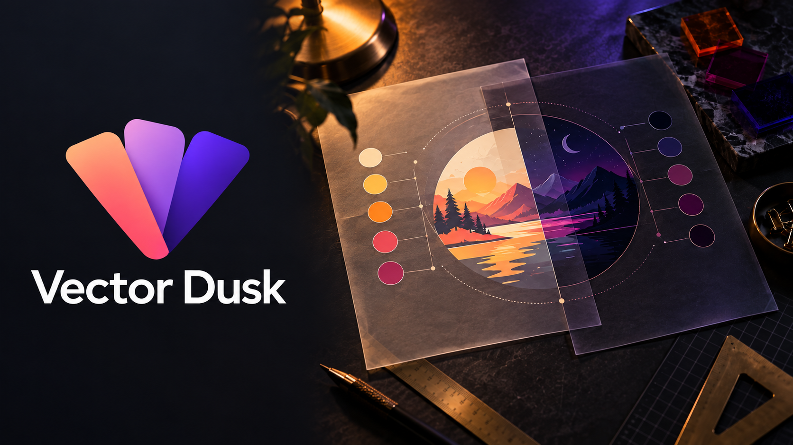

# Vector Dusk™



**A local-first dark palette editor for SVG and Android VectorDrawable artwork.** Import illustrations, refine their colors with side-by-side previews, and export files ready for your project. Artwork is processed in your browser, with no account or uploads.

[User guide](guide.html) · [Privacy](privacy.html) · [Deployment](DEPLOYMENT.md)

## What it does

- **Edit at the right scope.** Change one color use, one illustration, or the shared palette across a collection.
- **Build consistent dark palettes.** Adjust replacements directly or explore tints and shades.
- **Work with Android resources.** Import VectorDrawable XML and light-mode `colors.xml` references; export dark resources under their original filenames.
- **Keep your work portable.** Save a profile for shared colors, or download a workspace containing artwork and overrides.
- **Export without a service.** Download an individual SVG/XML file or the full collection as a ZIP.

## Quick start

Requires **Node.js 22+** and **Python 3**. From this directory:

```sh
npm run build
python3 -m http.server 8765 --bind 127.0.0.1 --directory dist
```

Open [http://127.0.0.1:8765](http://127.0.0.1:8765). Keep the terminal running while you use the editor; press **Ctrl+C** to stop. Rebuild and refresh after changing source files. The build and site have no runtime package dependencies, so `npm install` is not needed for this quick start.

## Editing workflow

1. Import SVG or Android VectorDrawable XML, or paste the artwork. For Android resource references, import the corresponding light-mode `colors.xml`.
2. Select a color, choose a replacement or tint/shade, and set the scope to **this use**, **this illustration**, or **all illustrations**.
3. Save a **profile** to retain shared palette settings in this browser. Save a **workspace** to download the artwork and all overrides; reopen either exported JSON file with **Import JSON**.
4. Export one file or the collection ZIP. Place exported Android XML files in `res/drawable-night/` using their original filenames.

Save a workspace before closing or refreshing the page. Profiles do not contain artwork.

## Development

Install the pinned formatter and run the checks:

```sh
npm ci
npm run format:check
npm test
npm run build
npm run test:site
```

`npm run format` applies formatting. Automated browser tests use Chrome and a temporary profile; set `CHROME_BIN` if Chrome is installed in a nonstandard location. Firefox and Safari need manual checks. See [Deployment](DEPLOYMENT.md) for publishing and release checks.

The source is intentionally small: `colors.js` handles palette math and resource resolution; `vector.js` and `svg.js` handle their respective formats; `app.js` owns editor state and interactions; `zip.js` writes downloads. `build.mjs` publishes approved files to generated `dist/`.

## Format and preview limits

Vector Dusk edits static artwork; it does not convert SVG to VectorDrawable or vice versa. Expand SVG `symbol`/`use` instances before importing. Unsupported SVG content is removed with preview notes. Android previews may approximate tint, trim paths, and sweep gradients, so verify exported resources in Android Studio or on a device.

Limits are **5 MB per vector**, **100 illustrations per workspace**, and **50 MB per workspace JSON**.

## License and branding

Source code and documentation are under the [MIT license](LICENSE). The Vector Dusk name and `icon.png` have separate [branding terms](BRANDING.md).
